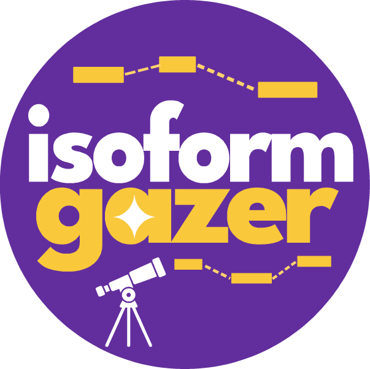

<table>
<tr>
<td>
  
</td>
<td>
  <h1 style="margin-bottom:0;">Isoform Gazer</h1>
  <p style="margin-top:5px;"><em>A comprehensive dashboard application for visualizing RNA splicing events across pseudobulked single-cell junction usage and long-read isoform expression data.</em></p>
</td>
</tr>
</table>

## Data Availability
To run IsoformGazer locally, all master table data is available through the v0.0.0 prerelease. You can either download the data directly through Github and ensure it is present in the ```src/isoformgazer/data``` directory, or run the provided helper script at ```src/isoformgazer/download_master_table_data.py``` to automatically download both master tables. 

Note that all data in Isoform Gazer uses GENCODEv46 (GRCh38.p14). 

## Installation 
Installation is currently supported for Linux and MacOS. 

### Option 1: Poetry (Recommended)

1. Ensure you are using Python version 3.12 or greater.

2. Clone the repository and ``cd`` in:
```
git clone https://github.com/daklab/IsoformGazer.git
cd IsoformGazer
```

3. Install Poetry if not already installed: 
```
python3 -m pip install pipx
python3 -m pipx ensurepath
pipx install poetry
```
Alternatively, you can also install Poetry using: 
```
curl -sSL https://install.python-poetry.org | python3 -
```

4. Within the ``IsoformGazer`` repository, use Poetry to install and manage all dependencies: 
```
poetry install
```

Please note that if you run ``git pull`` in order to update to the latest version of IsoformGazer, you should also rerun the ``poetry install`` command afterwards. 

If you're interested in viewing details on the package dependencies and other options Poetry offers, within the IsoformGazer repository you can run: 
```
poetry show --help 
```

### Option 2: Conda (TO DO)
A bioconda recipe may be created at a later date. We will also add instructions for creating the necessary environment from scratch.

## Usage
After installing all the required dependencies as shown in the Installation section, you can run IsoformGazer on your local machine by running the following within the ``IsoformGazer`` directory:
```
poetry run python src/isoformgazer/app.py
``` 
This will launch IsoformGazer on local host. Open the address (e.g. http://127.0.0.1:8050/) in a browser of your choice. 
